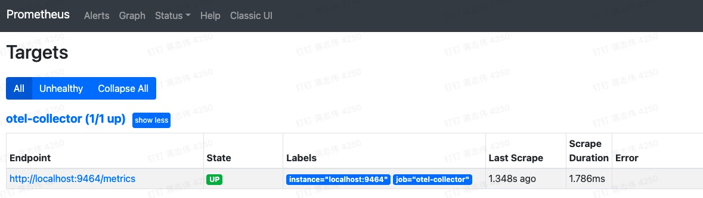

<a name="wSh88"></a>
# opentelemetry-jaeger
<a name="XGdFY"></a>
## Introduction
OpenTelemetry+Jaeger+Prometheus的分布式链路追踪演示案例

- Load Balance ：Nginx
- 前端：Java SpringBoot Web + OpenTelemetry +  Jaeger Trace Exporter  + Prometheus Metric Exporter
- 后端：Jaeger UI 、Prometheus UI

深入了解可观测体系下Traces概念和运行原理<br />演示地址 [http://106.14.209.9/](http://106.14.209.9/)<br />
  - 
## Architecture 

<a name="cqdhz"></a>
## Tracing 效果图
 
## Prometheus 采集Metric 
 
## 框架列表
| **Library/Framework** | **Versions** | **备注** |
| --- | --- | --- |
| opentelemetry-api | 1.9.1 | ​<br /> |
| opentelemetry-sdk | 1.9.1 | ​<br /> |
| opentelemetry-exporter-jaeger | 1.9.1 |  |
| opentelemetry-semconv | 1.9.0-alpha | 目前只有alpha版本 |
| jaegertracing | all-in-one:1.29 | docker镜像 |
| spring-boot | 2.6.2 | JDK 1.8+ |
| nginx | 1.16.1 |  |
<a name="tfZIA"></a>
## Compiling project
<a name="KDdV7"></a>
### Linux 
  - 下载最新opentelemetry-javaagent.jar [官方](https://github.com/open-telemetry/opentelemetry-java-instrumentation/tags) , 在Dockerfile同目录下命名为opentelemetry-javaagent.jar，具体看Dockerfile配置
  - Docker 环境，三个服务部署在一台服务器上，网络Host模式
```shell
## down
docker-compose -f /path/docker-compose.yml  down
## start
docker-compose -f /path/docker-compose.yml  up -d
```
<a name="Je6W1"></a>
### Mac
Mac 用Docker Host 模式很坑，建议网络 bridge模式
```yaml
networks:
  jaeger:
  
services: 
    jaeger:
        image: jaegertracing/all-in-one:1.29
        networks:
            - jaeger
```
<a name="T6DHp"></a>
## Documentation 
[https://github.com/open-telemetry/opentelemetry-java-instrumentation](https://github.com/open-telemetry/opentelemetry-java-instrumentation)<br />[https://www.jaegertracing.io/docs/1.29/getting-started/](https://www.jaegertracing.io/docs/1.29/getting-started/)<br />[https://opentelemetry.io/docs/](https://opentelemetry.io/docs/)
## 联系
如果有什么疑问和建议，欢迎提交issues，我会第一时间回复
